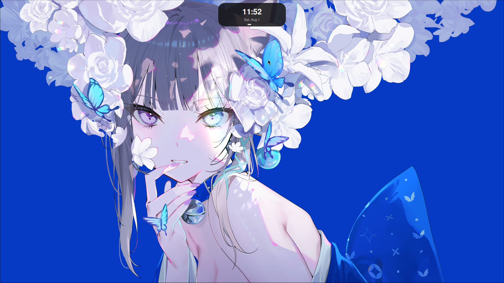
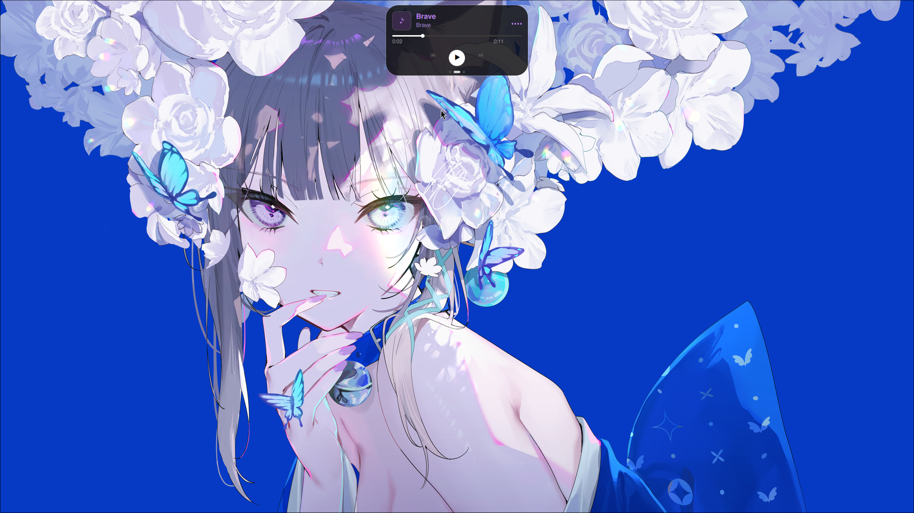
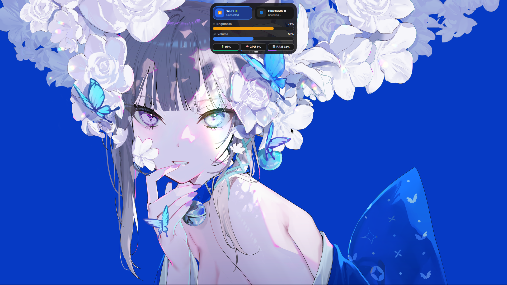
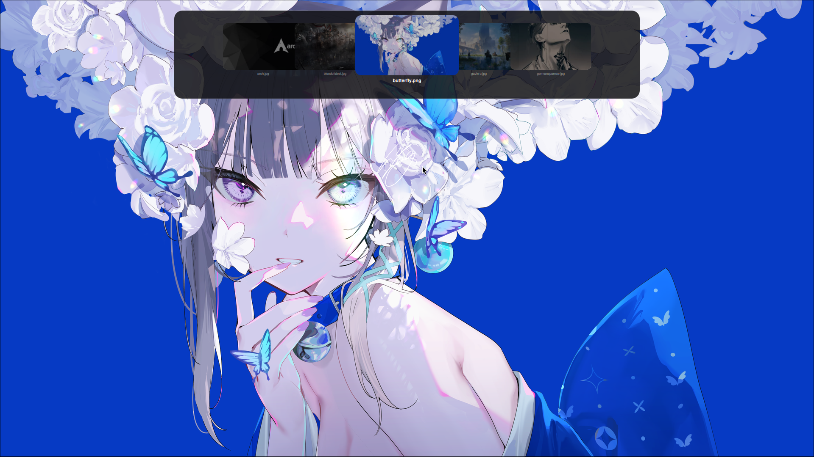
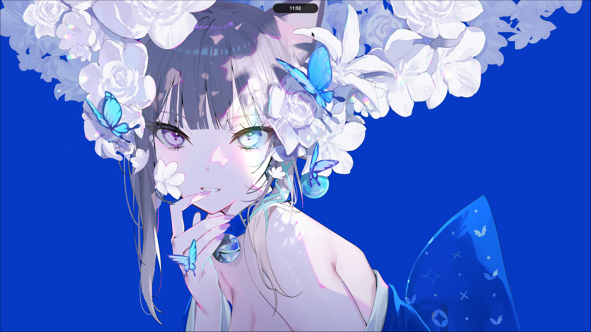
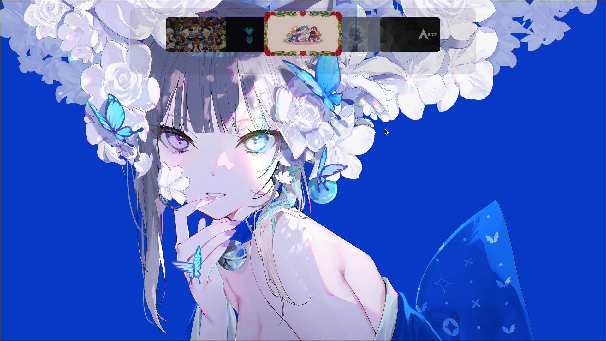
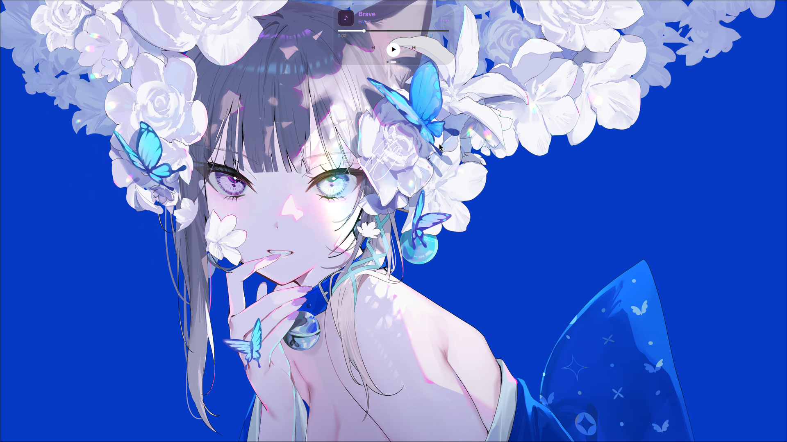
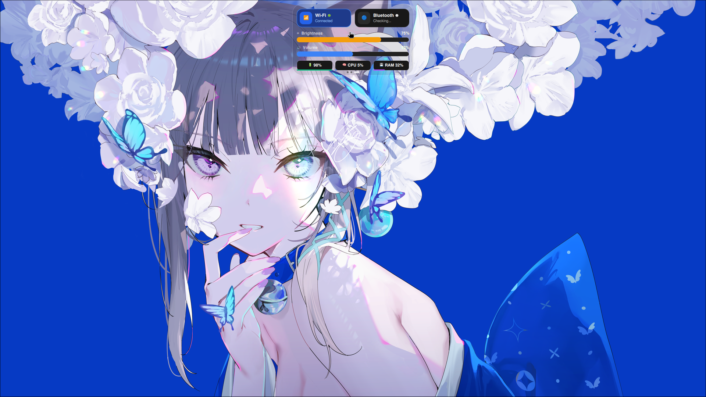
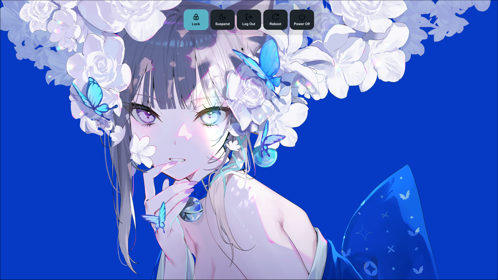

<div align="center">

# 🏝️ nowoward-capdynamic

### **Apple-Style Dynamic Island & Cover-Flow Wallpaper Picker for Hyprland**

*Bring fluid macOS-inspired Dynamic Island capsules, interactive Control Center cards, live MPRIS audio visualizers, and liquid glass wallpaper browsing to your Wayland desktop!*

[](https://hyprland.org)
[](https://quickshell.org)
[](https://github.com/Sidharth7082/myglass)
[](FAQ.md)
[](LICENSE)

</div>

---

## ⚡ 1-Minute Instant Launch

Copy and paste this single command into your terminal to clone, set up, and run immediately:

```bash
git clone https://github.com/Sidharth7082/nowoward-capdynamic.git ~/.config/quickshell/nowoward-capdynamic && quickshell -p ~/.config/quickshell/nowoward-capdynamic
```

---

## 🧊 How to Enable MyGlass Mode (Liquid Glass)

If you use **[MyGlass](https://github.com/Sidharth7082/myglass)** for Apple-style liquid frosted glass effects on Hyprland, follow these 3 simple steps:

### 📥 Step 1: Download & Install MyGlass
```bash
hyprpm add https://github.com/Sidharth7082/myglass && hyprpm update && hyprpm enable myglass
```

### ⚙️ Step 2: Configure Layer Surface Rules

#### Option A: Lua Config (`~/.config/hypr/module/myglass.lua`)
```lua
if hl.plugin and hl.plugin.myglass then
    local hg = hl.plugin.myglass
    hg.config({
        enabled = true,
        default_theme = "dark",
        default_preset = "clear",
        tint_color = 0x00000000,
        glass_opacity = 0.09,
        blur_strength = 0.04,
    })

    -- Enable liquid glass on Dynamic Island, Wallpaper Picker & WLogout
    hg.layer("nowoward-capdynamic", { preset = "clear" })
    hg.layer("nowoward-capdynamic-wallpaperpicker", { preset = "clear" })
    hg.layer("nowoward-capdynamic-wlogout", { preset = "clear" })
end
```

#### Option B: Legacy Config (`hyprland.conf`)
```ini
plugin:myglass {
    default_theme = dark
    default_preset = clear
    glass_opacity = 0.09

    layers {
        enabled = 1
        namespaces = nowoward-capdynamic, nowoward-capdynamic-wallpaperpicker, nowoward-capdynamic-wlogout
        preset = clear
    }
}
```

### 🔄 Step 3: Reload Hyprland
```bash
hyprctl reload
```

---

### ❌ How to Turn OFF MyGlass Mode

To turn OFF liquid glass mode and revert back to solid translucent dark capsules:

* **Method 1: Terminal Command**
  ```bash
  hyprpm disable myglass && hyprctl reload
  ```

* **Method 2: Hyprland Config**
  - In Lua (`~/.config/hypr/module/myglass.lua`): set `enabled = false` in `hg.config({ enabled = false })`.
  - In `hyprland.conf`: set `enabled = 0` under `layers`.
  - Run `hyprctl reload` to apply.

---

### 🔀 Instant 1-Key Toggle (`SUPER + SHIFT + G`)

To easily switch back and forth between **MyGlass (Liquid Glass)** and **Default Island Mode** at any time:

Add this keybinding to your Hyprland configuration (`~/.config/hypr/module/keybind.lua`):

```lua
-- Toggle MyGlass Liquid Glass vs Default Island Mode
hl.bind("SUPER + SHIFT + G", hl.dsp.exec_cmd("~/.config/hypr/scripts/toggle_myglass.sh"))
```

Or for `hyprland.conf`:
```ini
bind = SUPER SHIFT, G, exec, ~/.config/hypr/scripts/toggle_myglass.sh
```

---

## 🖼️ Visual Showcase

<div align="center">

### 🌟 Default Dynamic Island

| 🕒 Clock & Date Page | 🎵 MPRIS Music Player |
| :---: | :---: |
|  |  |

| ⚙️ Control Center & System Stats | 🖼️ Cover-Flow Wallpaper Picker |
| :---: | :---: |
|  |  |

| 💊 Collapsed Clock Pill | 🚪 Top WLogout Overlay |
| :---: | :---: |
|  |  |

---

### 🧊 MyGlass Liquid Glass Mode

| 🖼️ Cover-Flow Wallpaper Picker | 🕒 Clock & Date Page |
| :---: | :---: |
|  |  |

| 🎵 MPRIS Music Player | ⚙️ Control Center & System Stats |
| :---: | :---: |
|  |  |

| 💊 Collapsed Clock Pill | 🚪 Top WLogout Overlay |
| :---: | :---: |
|  |  |

</div>

---

## ✨ Features & Component Highlights

| Feature | Description |
| :--- | :--- |
| **🏝️ Dynamic Capsule Morphing** | Smooth Apple-style `OutBack` spring physics that expand, collapse, and scale dynamically on interaction. |
| **🕒 Minimal Clock & Date** | Compact clock pill that reveals when cursor reaches top edge and expands into date view on click. |
| **🎵 Live MPRIS Visualizer** | Controls Spotify, Brave, mpv, or any MPRIS player with spinning album art and live animated audio frequency bars. |
| **⚙️ Control Center Card** | Interactive Brightness & Volume sliders, real-time CPU %, RAM %, and Battery % badges with animated fill bars. |
| **📶 Wi-Fi Sub-Page** | Left-click toggle, right-click opens dedicated in-island network scanner page with live SSIDs and signal strength. |
| **🔵 Bluetooth Sub-Page** | Left-click toggle, right-click opens dedicated in-island device scanner page with auto-start daemon prompt. |
| **🔔 DBus Notification Toasts** | Automatically peeks desktop alerts with app badges, titles, and text summaries. |
| **🔊 Transient Volume Overlay** | Displays a sleek audio level indicator pill whenever hardware volume keys are pressed. |
| **🎯 Top-Edge Sensor** | Remains 100% hidden offscreen until pointer touches top monitor edge. |
| **🙈 Window Auto-Hide** | Hides automatically when active workspace windows are present to keep titlebars and browser tabs clear. |
| **🎨 Apple-Style Emoji Picker** | Built-in 1800+ Unicode 16.0 emoji grid with category tabs, live search input, recent list, and 1-click `wl-copy` clipboard integration (`SUPER + SHIFT + E`). |
| **🖼️ Cover-Flow Wallpaper Browser** | Smooth PathView wallpaper carousel with `ffmpeg` thumbnail caching and `awww` / `mpvpaper` backends. |

---

## 📦 Dependency Matrix

| Category | Package Name | Command / Source | Purpose |
| :--- | :--- | :--- | :--- |
| **Core** | `hyprland` | `sudo pacman -S hyprland` | Wayland Compositor |
| **Core** | `quickshell` | `quickshell` (PATH) | QML Desktop Shell Framework |
| **Core** | `ffmpeg` | `sudo pacman -S ffmpeg` | Wallpaper Thumbnail Generation |
| **Wallpaper** | `awww` | `yay -S awww` | Static Wallpaper Backend |
| **Wallpaper** | `mpvpaper` | `yay -S mpvpaper` (Optional) | Video Wallpaper Backend |
| **Control** | `brightnessctl` | `sudo pacman -S brightnessctl` | Display Brightness Slider Control |
| **Control** | `wireplumber` | `sudo pacman -S wireplumber` | Audio Volume Slider Control |
| **Control** | `networkmanager` | `sudo pacman -S networkmanager` | Wi-Fi Power & Network Scanning |
| **Control** | `bluez-utils` | `sudo pacman -S bluez bluez-utils` | Bluetooth Power & Device Scanning |
| **Plugin** | `myglass` | `hyprpm add https://github.com/Sidharth7082/myglass` | Frosted Liquid Glass Effects |

---

## 🎮 IPC Command Reference

Control the Dynamic Island or Wallpaper Picker from terminal scripts, waybar buttons, or custom keybinds:

| Action | Command |
| :--- | :--- |
| **Toggle Island Expand / Collapse** | `quickshell ipc -p ~/.config/quickshell/nowoward-capdynamic call island toggle` |
| **Show Clock Page** | `quickshell ipc -p ~/.config/quickshell/nowoward-capdynamic call island clock` |
| **Show Music Player Page** | `quickshell ipc -p ~/.config/quickshell/nowoward-capdynamic call island player` |
| **Show Control Center Page** | `quickshell ipc -p ~/.config/quickshell/nowoward-capdynamic call island stats` |
| **Show Notification History** | `quickshell ipc -p ~/.config/quickshell/nowoward-capdynamic call island notifs` |
| **Show Wi-Fi Detail Page** | `quickshell ipc -p ~/.config/quickshell/nowoward-capdynamic call island wifi` |
| **Show Bluetooth Detail Page** | `quickshell ipc -p ~/.config/quickshell/nowoward-capdynamic call island bluetooth` |
| **Show Logout Menu (Island)** | `quickshell ipc -p ~/.config/quickshell/nowoward-capdynamic call island logout` |
| **Toggle WLogout Overlay** | `quickshell ipc -p ~/.config/quickshell/nowoward-capdynamic call wlogout toggle` |
| **Toggle Wallpaper Picker** | `quickshell ipc -p ~/.config/quickshell/nowoward-capdynamic call picker toggle` |
| **Force Show Wallpaper Picker** | `quickshell ipc -p ~/.config/quickshell/nowoward-capdynamic call picker show` |
| **Force Hide Wallpaper Picker** | `quickshell ipc -p ~/.config/quickshell/nowoward-capdynamic call picker hide` |

---

## ⚙️ Hyprland Configuration Guide

### 📜 Lua Setup (`~/.config/hypr/module/autostart.lua` & `keybind.lua`)

```lua
-- autostart.lua
hl.on("hyprland.start", function ()
    hl.exec_cmd("quickshell -p ~/.config/quickshell/nowoward-capdynamic &")
end)

-- keybind.lua
hl.bind("SUPER + I", hl.dsp.exec_cmd("quickshell ipc -p ~/.config/quickshell/nowoward-capdynamic call island toggle"))
hl.bind("SUPER + N", hl.dsp.exec_cmd("quickshell ipc -p ~/.config/quickshell/nowoward-capdynamic call island notifs"))
hl.bind("SUPER + L", hl.dsp.exec_cmd("quickshell ipc -p ~/.config/quickshell/nowoward-capdynamic call wlogout toggle"))
hl.bind("SUPER + SHIFT + W", hl.dsp.exec_cmd("quickshell ipc -p ~/.config/quickshell/nowoward-capdynamic call picker toggle"))
hl.bind("SUPER + SHIFT + G", hl.dsp.exec_cmd("~/.config/hypr/scripts/toggle_myglass.sh"))
```

### 📝 Legacy Setup (`hyprland.conf`)

```ini
# Autostart
exec-once = quickshell -p ~/.config/quickshell/nowoward-capdynamic

# Keybindings
bind = SUPER, I, exec, quickshell ipc -p ~/.config/quickshell/nowoward-capdynamic call island toggle
bind = SUPER, N, exec, quickshell ipc -p ~/.config/quickshell/nowoward-capdynamic call island notifs
bind = SUPER, L, exec, quickshell ipc -p ~/.config/quickshell/nowoward-capdynamic call wlogout toggle
bind = SUPER, SHIFT, W, exec, quickshell ipc -p ~/.config/quickshell/nowoward-capdynamic call picker toggle
bind = SUPER SHIFT, G, exec, ~/.config/hypr/scripts/toggle_myglass.sh
```

---

## 📁 Repository Structure

```
nowoward-capdynamic/
├── shell.qml                              # Main entrypoint & IPC handlers ("island", "picker", "wlogout")
├── DynamicIslandWindow.qml                # Capsule geometry, animations, mask, spring physics
├── wlogout/                               # Custom wlogout theme & configuration
│   ├── layout                             # wlogout button actions & keybindings
│   ├── style.css                          # Custom top-capsule GTK stylesheet
│   ├── launch.sh                          # Direct launch script for GTK wlogout
│   ├── install.sh                         # Install theme to ~/.config/wlogout
│   └── icons/                             # SVG action icons (lock, suspend, logout, reboot, shutdown)
├── qml/
│   ├── theme/
│   │   ├── Colors.qml                     # Translucent glass color tokens
│   │   └── Theme.qml                      # Capsule dimensions & metrics
│   ├── services/
│   │   ├── CpuService.qml                 # CPU % monitor (/proc/stat)
│   │   ├── MemService.qml                 # RAM % monitor (/proc/meminfo)
│   │   ├── BatteryService.qml             # Battery capacity monitor
│   │   ├── NotificationService.qml        # DBus Notification listener
│   │   ├── VolumeService.qml              # WirePlumber audio control
│   │   ├── BrightnessService.qml          # brightnessctl display control
│   │   ├── NetworkService.qml             # NetworkManager Wi-Fi scanner
│   │   └── BluetoothService.qml           # BlueZ Bluetooth scanner
│   ├── island/
│   │   ├── IslandClock.qml                # Clock & date formatter
│   │   ├── IslandMprisController.qml      # MPRIS player transport
│   │   ├── MusicPlayerLayer.qml           # Music player UI
│   │   ├── MusicVisualizer.qml            # Live audio frequency bars
│   │   ├── IslandSystemStats.qml          # Control Center card UI
│   │   ├── IslandWifiLayer.qml            # Dedicated Wi-Fi sub-page UI
│   │   ├── IslandBluetoothLayer.qml       # Dedicated Bluetooth sub-page UI
│   │   ├── IslandNotificationLayer.qml    # Notification toast UI
│   │   ├── IslandVolumeLayer.qml          # Volume overlay UI
│   │   └── IslandLogoutLayer.qml          # Dynamic Island Logout sub-page UI
│   ├── wlogout/
│   │   └── WLogoutPanel.qml               # Standalone top-capsule Logout overlay window
│   └── wallpaperpicker/
│       └── WallpaperPickerPanel.qml       # Cover-flow wallpaper browser
└── assets/
    ├── default_island/                    # Default mode screenshot assets
    └── myglass_on_island/                 # MyGlass mode screenshot assets
```

---

## 📜 License & Credits

- Created & Maintained by **[Sidharth7082](https://github.com/Sidharth7082)** (Capture)
- Built with **[Quickshell](https://quickshell.org)** for **[Hyprland](https://hyprland.org)**
- Open Source under the **MIT License**
