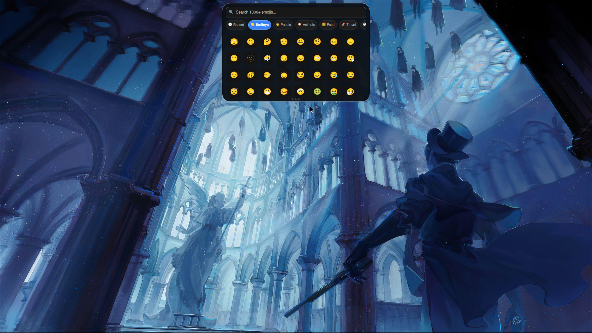
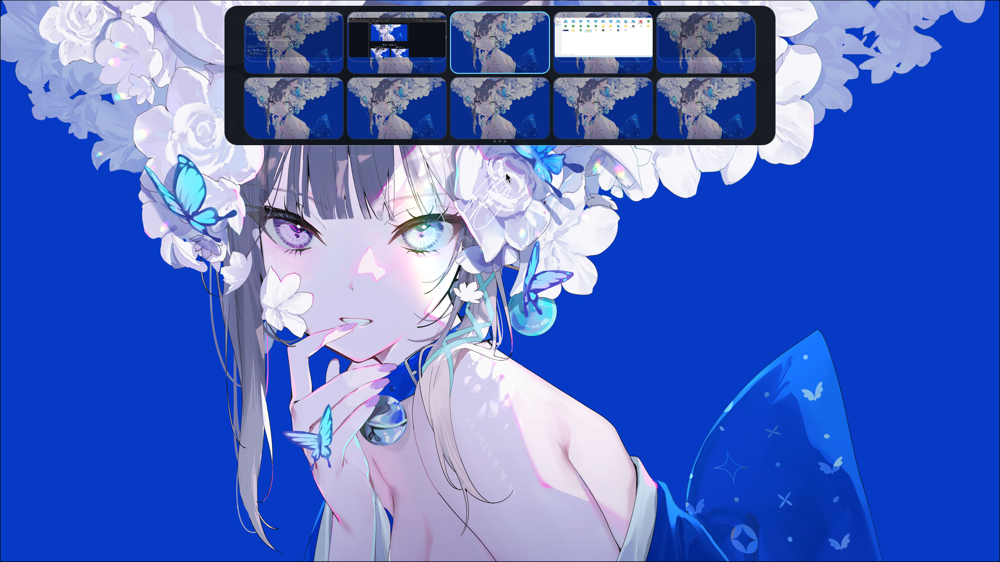
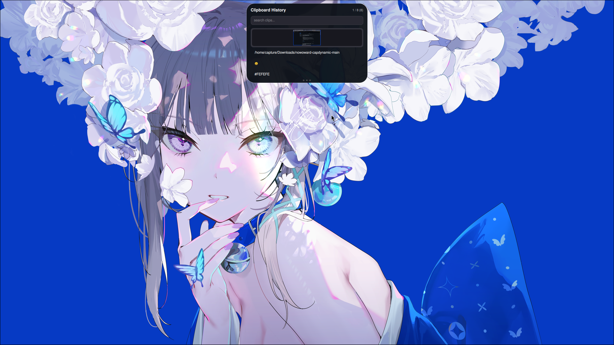
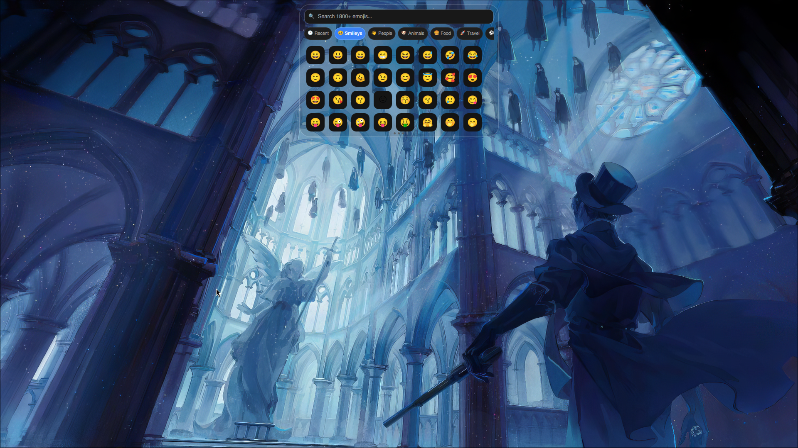
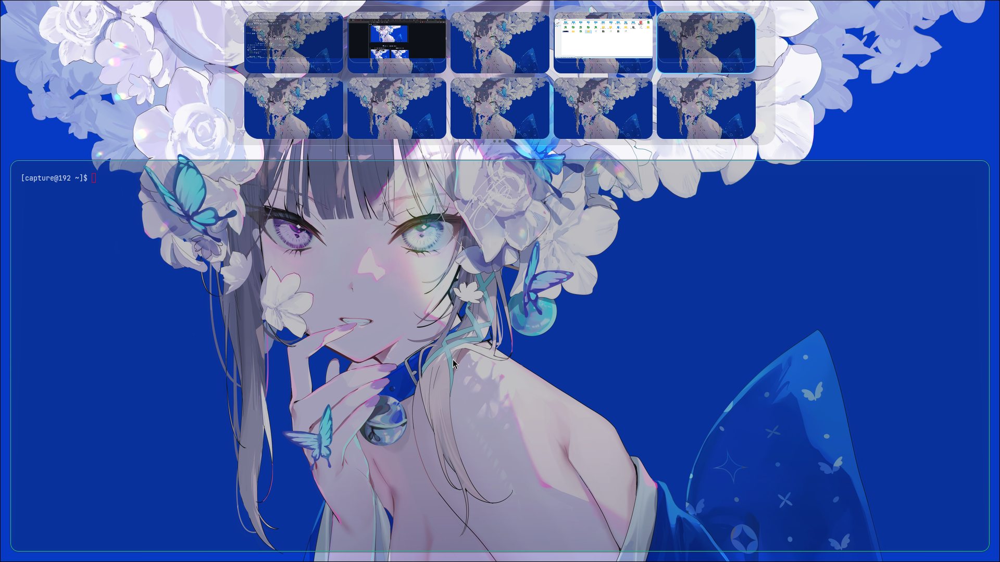
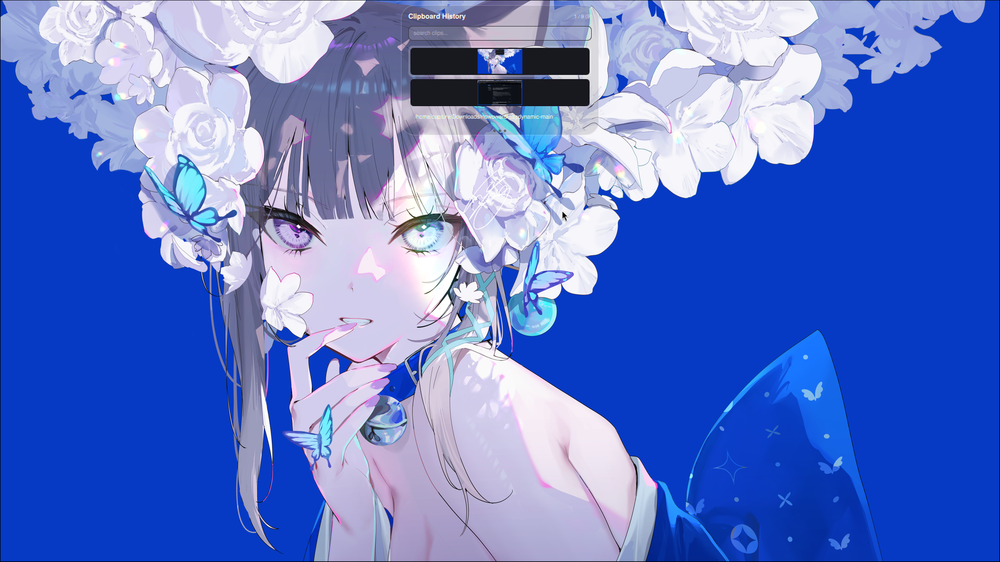

<div align="center">

# 🏝️ nowoward-capdynamic

### **Apple-Style Dynamic Island & Cover-Flow Wallpaper Picker for Hyprland**

*Bring fluid macOS-inspired Dynamic Island capsules, interactive Control Center cards, live MPRIS music controls with audio visualizers, and liquid-glass wallpaper browsing to your Wayland desktop.*

[](https://hyprland.org)
[](https://quickshell.org)
[](https://github.com/Sidharth7082/myglass)
[](LICENSE)

</div>

---

## ✨ What is this?

A fully-featured **Dynamic Island** for Hyprland, built with Quickshell/QML. It replaces the classic top bar with a macOS-iPhone-inspired pill that:

- **Sleeps as a tiny clock pill** at the top of your screen and hides off-screen when idle
- **Morphs into full pages** — Clock, Music Player, Control Center, Notifications, Wi-Fi, Bluetooth, Emoji Picker, Clipboard History, Workspace Overview, and a Logout menu — with spring-physics animations
- **Peeks automatically** when something happens: a new notification, a volume change, a workspace switch, or a track starts playing
- Swipes left/right between pages, collapses on idle, and works on **every monitor** at once

Everything is controllable from the terminal via `quickshell ipc`, from keyboard shortcuts, or by mouse (click, swipe, wheel, drag).

---

## 🚀 Quick Start

### 1. Install the dependencies

```bash
# Arch / EndeavourOS / CachyOS
sudo pacman -S hyprland quickshell ffmpeg cliphist wl-clipboard brightnessctl wireplumber networkmanager bluez bluez-utils

# AUR (wallpaper backends)
yay -S awww              # static wallpaper backend (recommended)
yay -S mpvpaper          # optional: video wallpapers
```

### 2. Clone & launch

```bash
git clone https://github.com/Sidharth7082/nowoward-capdynamic.git ~/.config/quickshell/nowoward-capdynamic
quickshell -p ~/.config/quickshell/nowoward-capdynamic
```

### 3. Autostart with Hyprland

**Lua config** (`~/.config/hypr/module/autostart.lua`):

```lua
hl.on("hyprland.start", function ()
    hl.exec_cmd("quickshell -p ~/.config/quickshell/nowoward-capdynamic &")
end)
```

**Legacy config** (`hyprland.conf`):

```ini
exec-once = quickshell -p ~/.config/quickshell/nowoward-capdynamic
```

> 💡 Clipboard history needs two small watchers running alongside the shell (add to your autostart):

```bash
wl-paste --type text --watch cliphist store &
wl-paste --type image --watch cliphist store &
```

---

## ⌨️ Recommended Keybinds

All features are one keypress away. Add these to your Hyprland config.

### Lua (`~/.config/hypr/module/keybind.lua`)

```lua
-- 🌐 Island pages
hl.bind("SUPER + I",         hl.dsp.exec_cmd("quickshell ipc -p ~/.config/quickshell/nowoward-capdynamic call island toggle"))
hl.bind("SUPER + N",         hl.dsp.exec_cmd("quickshell ipc -p ~/.config/quickshell/nowoward-capdynamic call island notifs"))
hl.bind("SUPER + SHIFT + P", hl.dsp.exec_cmd("quickshell ipc -p ~/.config/quickshell/nowoward-capdynamic call island player"))
hl.bind("SUPER + A",         hl.dsp.exec_cmd("quickshell ipc -p ~/.config/quickshell/nowoward-capdynamic call island stats"))
hl.bind("SUPER + SHIFT + N", hl.dsp.exec_cmd("quickshell ipc -p ~/.config/quickshell/nowoward-capdynamic call island wifi"))
hl.bind("SUPER + B",         hl.dsp.exec_cmd("quickshell ipc -p ~/.config/quickshell/nowoward-capdynamic call island bluetooth"))
hl.bind("SUPER + SHIFT + E", hl.dsp.exec_cmd("quickshell ipc -p ~/.config/quickshell/nowoward-capdynamic call island emojis"))
hl.bind("SUPER + SHIFT + V", hl.dsp.exec_cmd("quickshell ipc -p ~/.config/quickshell/nowoward-capdynamic call cliphist toggle"))
hl.bind("SUPER + TAB",       hl.dsp.exec_cmd("quickshell ipc -p ~/.config/quickshell/nowoward-capdynamic call island workspace"))
hl.bind("SUPER + M",         hl.dsp.exec_cmd("quickshell ipc -p ~/.config/quickshell/nowoward-capdynamic call wlogout toggle"))
hl.bind("SUPER + SHIFT + W", hl.dsp.exec_cmd("quickshell ipc -p ~/.config/quickshell/nowoward-capdynamic call picker toggle"))
hl.bind("SUPER + SHIFT + G", hl.dsp.exec_cmd("~/.config/hypr/scripts/toggle_myglass.sh"))

-- 🎵 Media keys (drive the island's MPRIS music player — no playerctl needed)
hl.bind("XF86AudioPlay",  hl.dsp.exec_cmd("hyprctl dispatch global nowoward-capdynamic:play-pause"), { locked = true })
hl.bind("XF86AudioPause", hl.dsp.exec_cmd("hyprctl dispatch global nowoward-capdynamic:play-pause"), { locked = true })
hl.bind("XF86AudioNext",  hl.dsp.exec_cmd("hyprctl dispatch global nowoward-capdynamic:next"),        { locked = true })
hl.bind("XF86AudioPrev",  hl.dsp.exec_cmd("hyprctl dispatch global nowoward-capdynamic:previous"),    { locked = true })
```

### Legacy (`hyprland.conf`)

```ini
# Island pages
bind = SUPER, I, exec, quickshell ipc -p ~/.config/quickshell/nowoward-capdynamic call island toggle
bind = SUPER, N, exec, quickshell ipc -p ~/.config/quickshell/nowoward-capdynamic call island notifs
bind = SUPER SHIFT, P, exec, quickshell ipc -p ~/.config/quickshell/nowoward-capdynamic call island player
bind = SUPER, A, exec, quickshell ipc -p ~/.config/quickshell/nowoward-capdynamic call island stats
bind = SUPER SHIFT, N, exec, quickshell ipc -p ~/.config/quickshell/nowoward-capdynamic call island wifi
bind = SUPER, B, exec, quickshell ipc -p ~/.config/quickshell/nowoward-capdynamic call island bluetooth
bind = SUPER SHIFT, E, exec, quickshell ipc -p ~/.config/quickshell/nowoward-capdynamic call island emojis
bind = SUPER SHIFT, V, exec, quickshell ipc -p ~/.config/quickshell/nowoward-capdynamic call cliphist toggle
bind = SUPER, TAB, exec, quickshell ipc -p ~/.config/quickshell/nowoward-capdynamic call island workspace
bind = SUPER, M, exec, quickshell ipc -p ~/.config/quickshell/nowoward-capdynamic call wlogout toggle
bind = SUPER SHIFT, W, exec, quickshell ipc -p ~/.config/quickshell/nowoward-capdynamic call picker toggle

# Media keys (drive the island's MPRIS player)
bind = , XF86AudioPlay, global, nowoward-capdynamic:play-pause
bind = , XF86AudioNext, global, nowoward-capdynamic:next
bind = , XF86AudioPrev, global, nowoward-capdynamic:previous
```

### Keybind reference

| Shortcut | Action |
| :--- | :--- |
| `SUPER + I` | Toggle island expand / collapse |
| `SUPER + N` | Notification history page |
| `SUPER + SHIFT + P` | Music player page |
| `SUPER + A` | Control center (stats) page |
| `SUPER + SHIFT + N` | Wi-Fi page |
| `SUPER + B` | Bluetooth page |
| `SUPER + SHIFT + E` | Emoji picker |
| `SUPER + SHIFT + V` | Clipboard history |
| `SUPER + TAB` | Workspace overview (keys `1`–`0`, arrows, `Enter`/`Space` navigate) |
| `SUPER + M` | WLogout overlay |
| `SUPER + SHIFT + W` | Cover-flow wallpaper picker |
| `SUPER + SHIFT + G` | Toggle MyGlass liquid glass mode |
| `XF86AudioPlay/Pause` | Play / pause (island peeks the music page) |
| `XF86AudioNext` / `XF86AudioPrev` | Next / previous track |

---

## 🖼️ Visual Showcase

### 🌟 Default Island

| 🕒 Clock & Date | 🎵 MPRIS Music Player |
| :---: | :---: |
|  |  |

| ⚙️ Control Center | 🖼️ Cover-Flow Wallpaper Picker |
| :---: | :---: |
|  |  |

| 💊 Collapsed Pill | 🎨 Emoji Picker |
| :---: | :---: |
|  |  |

| 🖥️ Workspace Overview | 📋 Clipboard History |
| :---: | :---: |
|  |  |

| 🚪 WLogout Overlay | |
| :---: | :---: |
|  | |

### 🧊 MyGlass Liquid Glass Mode

| 🖼️ Wallpaper Picker | 🕒 Clock & Date |
| :---: | :---: |
|  |  |

| 🎵 Music Player | ⚙️ Control Center |
| :---: | :---: |
|  |  |

| 💊 Collapsed Pill | 🎨 Emoji Picker |
| :---: | :---: |
|  |  |

| 🖥️ Workspace Overview | 📋 Clipboard History |
| :---: | :---: |
|  |  |

| 🚪 WLogout Overlay | |
| :---: | :---: |
|  | |

---

## ✨ Features

| Feature | Description |
| :--- | :--- |
| **🏝️ Capsule morphing** | Apple-style `OutBack` spring physics: the pill expands, collapses, scales, and rounds on interaction. |
| **🕒 Clock & date page** | Tap the pill to expand into a minimal clock; swipe between pages. Auto-hides off-screen until the cursor touches the top edge. |
| **🎵 MPRIS music player** | Full transport for Spotify, mpv, browsers, or any MPRIS player: album art, title/artist, draggable seek bar, shuffle/loop, next/prev/play-pause. Live animated frequency visualizer. Auto-peeks when a track starts. |
| **⚙️ Control center** | Brightness & volume sliders (debounced — one process per drag, not per pixel), live CPU %, RAM %, battery % with animated fill bars. |
| **🔔 Notification toasts** | DBus notifications peek with app badge, title and body; expandable; history page keeps the last 20. Never hijacks the island while you're using it. |
| **🔊 Volume overlay** | Transient pill shows the level whenever hardware volume keys are pressed. |
| **📶 Wi-Fi page** | Live SSID scan with signal strength, connect state, rescan; right-click toggles power. |
| **🔵 Bluetooth page** | Device scan, power toggle, and a smart start-button that detects whether BlueZ is missing, inactive, or running — with the exact command to fix it. |
| **📋 Clipboard history** | `cliphist` integration: search, text & image previews, MIME-correct copy, delete with hold-to-confirm animation, keyboard navigation. |
| **🎨 Emoji picker** | 1800+ Unicode 16.0 emojis with category tabs, live search, recent list, one-click `wl-copy`. |
| **🖥️ Workspace overview** | 2×5 grid of workspaces 1–10 with wallpaper previews, mini app tiles, active-workspace highlight, number-key jumps, drag windows between workspaces. |
| **🚪 Logout menu** | Lock / suspend / logout / reboot / shutdown — both in-island and as a GTK wlogout overlay. |
| **🖼️ Cover-flow wallpaper picker** | Smooth PathView carousel with `ffmpeg`-generated thumbnail cache (loads instantly the second time), `awww` static + `mpvpaper` video backends. |
| **🎯 Top-edge sensor** | The pill stays 100% hidden off-screen; touching the top edge of the monitor reveals it. |
| **🙈 Fullscreen-aware** | Hides automatically while a fullscreen window is on the active workspace. |
| **🖥️ Multi-monitor** | One island per screen, each with its own focus state, peek, and page. |
| **🧊 MyGlass support** | Liquid-glass frosted effect via the MyGlass hyprland plugin, toggleable at runtime. |

---

## 🎮 IPC Command Reference

Drive the shell from scripts, waybar/eww buttons, or your keybinds:

| Action | Command |
| :--- | :--- |
| Toggle island | `quickshell ipc -p ~/.config/quickshell/nowoward-capdynamic call island toggle` |
| Show island | `quickshell ipc -p ~/.config/quickshell/nowoward-capdynamic call island show` |
| Hide island | `quickshell ipc -p ~/.config/quickshell/nowoward-capdynamic call island hide` |
| Clock page | `quickshell ipc -p ~/.config/quickshell/nowoward-capdynamic call island clock` |
| Music player page | `quickshell ipc -p ~/.config/quickshell/nowoward-capdynamic call island player` |
| Control center page | `quickshell ipc -p ~/.config/quickshell/nowoward-capdynamic call island stats` |
| Notification history | `quickshell ipc -p ~/.config/quickshell/nowoward-capdynamic call island notifs` |
| Clipboard page | `quickshell ipc -p ~/.config/quickshell/nowoward-capdynamic call island cliphist` |
| Toggle clipboard overlay | `quickshell ipc -p ~/.config/quickshell/nowoward-capdynamic call cliphist toggle` |
| Wi-Fi page | `quickshell ipc -p ~/.config/quickshell/nowoward-capdynamic call island wifi` |
| Bluetooth page | `quickshell ipc -p ~/.config/quickshell/nowoward-capdynamic call island bluetooth` |
| Logout page | `quickshell ipc -p ~/.config/quickshell/nowoward-capdynamic call island logout` |
| Toggle wlogout overlay | `quickshell ipc -p ~/.config/quickshell/nowoward-capdynamic call wlogout toggle` |
| Emoji picker | `quickshell ipc -p ~/.config/quickshell/nowoward-capdynamic call island emojis` |
| Workspace overview | `quickshell ipc -p ~/.config/quickshell/nowoward-capdynamic call island workspace` |
| Toggle wallpaper picker | `quickshell ipc -p ~/.config/quickshell/nowoward-capdynamic call picker toggle` |
| Force show picker | `quickshell ipc -p ~/.config/quickshell/nowoward-capdynamic call picker show` |
| Force hide picker | `quickshell ipc -p ~/.config/quickshell/nowoward-capdynamic call picker hide` |
| Glass mode on / off / toggle | `quickshell ipc -p ~/.config/quickshell/nowoward-capdynamic call theme glassMode` / `defaultMode` / `toggle` |

---

## ⚙️ Configuration

### `qml/theme/Theme.qml` — sizes & colors

| Property | Default | Purpose |
| :--- | :--- | :--- |
| `isMyGlass` | `true` | Liquid glass vs solid translucent capsule |
| `bg` / `border` | — | Capsule background & border color |
| `text` / `subtext` / `muted` | — | Text color tokens |
| `accent` | `#3b82f6` | Accent color (sliders, highlights, play button) |
| `collapsedWidth/Height` | `150 / 34` | Hidden pill size |
| `clockWidth/Height` | `260 / 92` | Clock page size |
| `playerWidth/Height` | `300 / 150` | Music player page size |
| `statsWidth/Height` | `330 / 195` | Control center size |
| `wifiWidth/Height`, `btWidth/Height` | `340 / 220` | Wi-Fi / Bluetooth page size |
| `notificationWidth/Height` | `240 / 38` | Notification peek size |
| `logoutWidth/Height` | `540 / 104` | Logout page size |

### `qml/services/UserConfig.qml` — personal preferences

| Property | Default | Purpose |
| :--- | :--- | :--- |
| `textFontFamily` / `heroFontFamily` | `"Sans"` | Font family used across the UI |
| `bodyFontSize` | `13` | Base font size |
| `dynamicIslandPrimaryButton` / `secondaryButton` | `left` / `right` | Mouse buttons for island interactions |
| `workspaceOverviewWindowDragButton` | `left` | Mouse button that drags windows in the overview |

---

## 📦 Dependency Matrix

| Category | Package | Purpose |
| :--- | :--- | :--- |
| **Core** | `hyprland` | Wayland compositor |
| **Core** | `quickshell` | QML desktop shell framework |
| **Core** | `ffmpeg` | Wallpaper thumbnail generation |
| **Clipboard** | `cliphist` | Clipboard history daemon |
| **Clipboard** | `wl-clipboard` | `wl-copy` / `wl-paste` |
| **Wallpaper** | `awww` (AUR) | Static wallpaper backend |
| **Wallpaper** | `mpvpaper` (AUR, optional) | Video wallpaper backend |
| **Control** | `brightnessctl` | Brightness slider |
| **Control** | `wireplumber` | Audio volume (via `wpctl`) |
| **Control** | `networkmanager` | Wi-Fi scanning & power |
| **Control** | `bluez` + `bluez-utils` | Bluetooth scanning & power |
| **Plugin** | `myglass` (`hyprpm`) | Liquid glass effects (optional) |

---

## 🧊 MyGlass Liquid Glass Mode

If you use **[MyGlass](https://github.com/Sidharth7082/myglass)** for Apple-style liquid frosted glass:

```bash
hyprpm add https://github.com/Sidharth7082/myglass && hyprpm update && hyprpm enable myglass
```

**Lua config** (`~/.config/hypr/module/myglass.lua`):

```lua
if hl.plugin and hl.plugin.myglass then
    local hg = hl.plugin.myglass
    hg.config({
        enabled = true,
        default_theme = "dark",
        default_preset = "clear",
        tint_color = 0x00000000,
        glass_opacity = 0.09,
        blur_strength = 0.04,
    })
    hg.layer("nowoward-capdynamic", { preset = "clear" })
    hg.layer("nowoward-capdynamic-wallpaperpicker", { preset = "clear" })
    hg.layer("nowoward-capdynamic-wlogout", { preset = "clear" })
end
```

**Legacy config** (`hyprland.conf`):

```ini
plugin:myglass {
    default_theme = dark
    default_preset = clear
    glass_opacity = 0.09
    layers {
        enabled = 1
        namespaces = nowoward-capdynamic, nowoward-capdynamic-wallpaperpicker, nowoward-capdynamic-wlogout
        preset = clear
    }
}
```

**Disable:** `hyprpm disable myglass && hyprctl reload`, or set `enabled = false` / `enabled = 0`.
**Toggle at runtime:** bind the `toggle_myglass.sh` script to a key (`SUPER + SHIFT + G`).

---

## 🔧 Troubleshooting

| Symptom | Fix |
| :--- | :--- |
| **Island doesn't respond to media keys** | The `XF86Audio*` binds must dispatch to the island's globals: `hyprctl dispatch global nowoward-capdynamic:play-pause` (not `playerctl`). See the keybind section. |
| **Bluetooth start button fails** | Starting BlueZ needs root. The island tells you the exact command (`sudo systemctl enable --now bluetooth`); it can do it automatically only if a polkit agent is running or `sudo -n` works. |
| **Wi-Fi list is empty** | Make sure NetworkManager is running (`systemctl status NetworkManager`), then hit the rescan button — the island runs `nmcli dev wifi rescan`. |
| **Wallpaper thumbnails are missing / slow the first time** | First open generates them with `ffmpeg` into `~/.cache/quickshell/nowoward-capdynamic/wallpaper-picker/`. They're instant after that. |
| **Notifications show twice / garbled** | Old builds had a duplicate DBus listener; update and reload. A duplicate toast can also mean another notification daemon (e.g. `dunst`) owns `org.freedesktop.Notifications` — run only one. |
| **Volume shows 0%** | On systems without `wpctl` the fallback parses `pactl` output — make sure `wireplumber` (or `pulseaudio`) is running. |
| **Brightness shows a huge number** | Fixed in recent builds: `brightnessctl -m` field order differs between versions; the parser now locates the percentage field instead of trusting an index. |
| **Island overlaps windows when opening the workspace overview** | By design since recent builds: the overview floats overlay-style (`exclusiveZone: 0`) instead of pushing every window down. |
| **The shell needs a reload after config edits** | Restart the shell to apply edits: `pkill quickshell && quickshell -p ~/.config/quickshell/nowoward-capdynamic`. |

---

## 📁 Repository Structure

```
nowoward-capdynamic/
├── shell.qml                              # Entrypoint: IPC handlers, global shortcuts, per-monitor windows
├── DynamicIslandWindow.qml                # Capsule geometry, animations, peek engine, page system
├── wlogout/                               # GTK wlogout theme (layout, style.css, launch.sh, icons/)
├── scripts/
│   ├── cliphist-img.sh                    # cliphist decode + MIME-correct wl-copy
│   └── gen_thumbs.sh                      # ffmpeg wallpaper thumbnail generation
├── qml/
│   ├── theme/
│   │   ├── Colors.qml                     # Color tokens
│   │   └── Theme.qml                      # Capsule dimensions & metrics
│   ├── services/                          # Background data singletons (polling + process parsing)
│   │   ├── CpuService.qml                 # CPU % (/proc/stat)
│   │   ├── MemService.qml                 # RAM % (/proc/meminfo)
│   │   ├── BatteryService.qml             # Battery capacity & charge state
│   │   ├── NotificationService.qml        # DBus notification server + history
│   │   ├── VolumeService.qml              # wpctl/pactl audio control
│   │   ├── BrightnessService.qml          # brightnessctl display control
│   │   ├── NetworkService.qml             # NetworkManager Wi-Fi scanning
│   │   ├── BluetoothService.qml           # BlueZ status/devices/start
│   │   ├── UsbService.qml                 # USB plug/unplug notifications
│   │   ├── EmojiService.qml               # Emoji database (assets/emojis.json)
│   │   ├── WorkspaceService.qml           # Active wallpaper preview
│   │   └── UserConfig.qml                 # User preferences (fonts, buttons)
│   ├── island/
│   │   ├── IslandClock.qml                # Clock & date page
│   │   ├── IslandMprisController.qml      # MPRIS player abstraction (seek/shuffle/loop)
│   │   ├── MusicPlayerLayer.qml           # Music player UI
│   │   ├── MusicVisualizer.qml            # Animated frequency bars
│   │   ├── IslandSystemStats.qml          # Control center (sliders, CPU/RAM/battery)
│   │   ├── IslandWifiLayer.qml            # Wi-Fi page
│   │   ├── IslandBluetoothLayer.qml       # Bluetooth page
│   │   ├── IslandNotificationLayer.qml    # Notification toast
│   │   ├── IslandNotificationCenterLayer.qml # Notification history page
│   │   ├── IslandVolumeLayer.qml          # Volume peek
│   │   ├── IslandWorkspaceLayer.qml       # Workspace-switch peek
│   │   ├── IslandLogoutLayer.qml          # Logout page
│   │   ├── IslandCliphist.qml             # Clipboard history page
│   │   └── IslandEmojiPicker.qml          # Emoji picker page
│   ├── workspace/
│   │   ├── HyprlandData.qml               # Event-driven client/monitor model
│   │   ├── WorkspaceOverviewLayer.qml     # 2×5 overview grid UI
│   │   ├── WorkspaceOverviewScene.qml     # Per-workspace wallpaper scene
│   │   └── CompositorWorkspaceTracker.qml # Workspace-change events
│   ├── cliphist/
│   │   └── CliphistPanel.qml              # Standalone clipboard overlay
│   ├── wallpaperpicker/
│   │   └── WallpaperPickerPanel.qml       # Cover-flow wallpaper browser
│   └── wlogout/
│       └── WLogoutPanel.qml               # Standalone wlogout overlay window
└── assets/
    ├── default_island/                    # Screenshots (default mode)
    └── myglass_on_island/                 # Screenshots (MyGlass mode)
```

---

## 🗺️ How It Works

- **One window per monitor** — `shell.qml` instantiates a `DynamicIslandWindow` for every screen via `Variants`, each with its own focus, page state and peeks.
- **Peeks, not popups** — services (notifications, volume, MPRIS, workspace changes) raise *peek* flags; the capsule morphs to the peek size, then collapses. Peeks never fight each other and never hijack an island you're actively using.
- **Services run as lightweight processes** — `CpuService`, `NetworkService`, etc. spawn small CLI tools (`/proc/stat`, `nmcli`, `bluetoothctl`, `wpctl`, `brightnessctl`) on guarded timers and parse stdout; UI mutations (sliders) are debounced to one process per drag.
- **MPRIS via Quickshell** — the music page binds to the platform MPRIS service (Spotify, mpv, browsers…), with capability-aware transport (seek/shuffle/loop only when the player supports them).
- **IPC first-class** — every page and action is exposed through `quickshell ipc`, so any script, bar, or keybind can drive the shell.

---

## 📜 License & Credits

- Created & Maintained by **[Sidharth7082](https://github.com/Sidharth7082)** (Capture)
- Built with **[Quickshell](https://quickshell.org)** for **[Hyprland](https://hyprland.org)**
- Open Source under the **MIT License**
